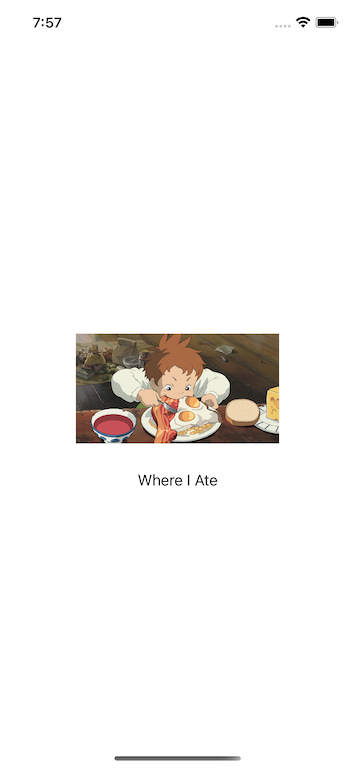

# Where I Ate 🍔

This app allows users to record memorable visits to their favorite restaurants.

## Screens




## CoreData Stack

```swift
//
//  CoreDataStack.swift
//

import CoreData

enum CoreDataStack {

    static let container: NSPersistentContainer = {
        //This line of code grabs the app name
        let appName = Bundle.main.object(forInfoDictionaryKey: (kCFBundleNameKey as String)) as! String

        let container = NSPersistentContainer(name: appName)
        container.loadPersistentStores() { (storeDescription, error) in
            if let error = error as NSError? {
                fatalError("unresolved error \(error), \(error.userInfo)")
            }
        }
        return container
    }()

    
    static var managedObjectContext: NSManagedObjectContext {
        return container.viewContext
    }

    static func saveContext() {
        if managedObjectContext.hasChanges {
            do {
                try managedObjectContext.save()
            } catch {
                NSLog("Error saving context \(error.localizedDescription)")
            }
        }
    }
}
```

## Convenience Initializer

```swift
//
//  Restaurant+Convenience.swift
//

import CoreData

extension Restaurant {
    convenience init(
        name: String,
        cuisine: String,
        city: String,
        notes: String,
        context: NSManagedObjectContext = CoreDataStack.managedObjectContext) {
        self.init(context: context)
            self.name = name
            self.cuisine = cuisine
            self.city = city
            self.notes = notes
    }
}
```

## Model Controller

```swift
//
//  RestaurantController.swift
//

import CoreData

class RestaurantController {
    static let shared = RestaurantController()
    
    private lazy var fetchRequest: NSFetchRequest<Restaurant> = {
        
        let request = NSFetchRequest<Restaurant>(entityName: "Restaurant")
        
        // if false, then all the entries are not fetched/presented to the user
        request.predicate = NSPredicate(value: true)
        
        return request
    }()
    
    //Array of fetched entries
    var fetchedEntries: [Restaurant] {
        do {
            return try CoreDataStack.managedObjectContext.fetch(self.fetchRequest)
        } catch {
            print("Error fetching entries: \(error.localizedDescription)")
            return []
        }
    }
    
    func createEntry(restaurant: Restaurant) {
        CoreDataStack.saveContext()
    }
    
    func updateEntry(
        restaurant: Restaurant,
        name: String,
        cuisine: String,
        city: String,
        notes: String
    ) {
        restaurant.name = name
        
        CoreDataStack.saveContext()
    }
    
    /*
     Batch delete function taken from the following website.
     https://www.advancedswift.com/batch-delete-everything-core-data-swift/
     */
    func deleteEverything() {
        
        // Specify a batch to delete with a fetch request
        let fetchRequest: NSFetchRequest<NSFetchRequestResult>
        fetchRequest = NSFetchRequest(entityName: "Entry")
        
        // Create a batch delete request for the
        // fetch request
        let deleteRequest = NSBatchDeleteRequest(
            fetchRequest: fetchRequest
        )
        
        // Specify the result of the NSBatchDeleteRequest
        // should be the NSManagedObject IDs for the
        // deleted objects
        deleteRequest.resultType = .resultTypeObjectIDs
        
        // Get a reference to a managed object context
        let context = CoreDataStack.managedObjectContext
        
        // Perform the batch delete
        do {
            let batchDelete = try context.execute(deleteRequest)
            as? NSBatchDeleteResult
            
            guard let deleteResult = batchDelete?.result
                    as? [NSManagedObjectID]
            else { return }
            
            let deletedObjects: [AnyHashable: Any] = [
                NSDeletedObjectsKey: deleteResult
            ]
            
            // Merge the delete changes into the managed
            // object context
            NSManagedObjectContext.mergeChanges(
                fromRemoteContextSave: deletedObjects,
                into: [context]
            )
        } catch {
            print(error.localizedDescription)
        }
    }
    
}
```
